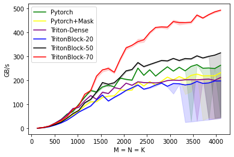

# TritonBlockSparseMatmul

A matmul kernel with block-sparsity based on [OpenAI-Triton's Matmul](https://github.com/openai/triton/blob/main/python/tutorials/08-experimental-block-pointer.py)) that works in Pytorch.

Currently, it's required to build triton-2.1.0 from source to use the newest block pointer. 

Basic Idea
---
Skip the pruned blocks along K-axis in `B` when loading. To avoid conditionals inside kernel, we precompute the skiping strides from the B-mask outside the kernel, which can be reused for different input `A`s. 

Benchmarking 
---
This implementation is faster than pytorch's native cublas-based matmul on >50% block-sparsity on A100, when `BLOCK_SIZE_M=128`, `BLOCK_SIZE_K=32` and `BLOCK_SIZE_N=64`, 

  

On 70% sparsity the speedup is almost 2× than cublas. 

Related Work
---
HuggingFace implemented a [blocksparse gemm kernel earlier](https://github.com/huggingface/pytorch_block_sparse) based on CUTLASS, but unfortunately the speedup isn't satisfactory yet for 50% sparsity. 

OpenAI also implemented [one for tensorflow](https://github.com/openai/blocksparse), Pytorch support is unfortunately not available. 

